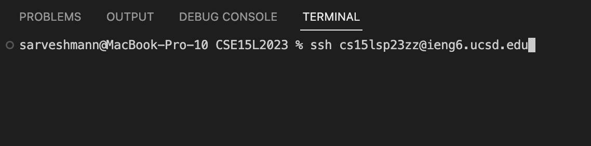
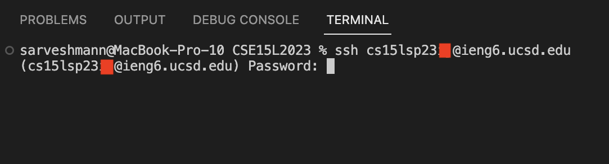
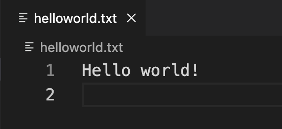

# Lab Report 1

## **Objectives:**

1. Installing VScode (*and Git for Windows*)

2. Remotely Connecting

3. Trying some commands

## **Instructions:**

> ### Step 1 -  Installing VScode:

  * Go to [VScode](https://code.visualstudio.com).
  * Select your operating system from the dropdown list.
  
      
  
  * Follow the instructions to download and install VScode.
   
*(If you are not using Windows operating system, skip to Step 2.)*
  * Download and install [Git for Windows](https://gitforwindows.org).
  * Follow the steps on this [link](https://stackoverflow.com/questions/42606837/how-do-i-use-bash-on-windows-from-the-visual-studio-code-integrated-terminal/50527994#50527994) to learn how to use Bash on VScode.

> ### Step 2 - Remotely Connecting

  * Open the Terminal window on VScode, using ctrl or command + ` or by clicking on Terminal -> New Terminal menu option.
  
      
      
  * Copy and paste (or type) the following command on your Terminal window: `ssh cs15lsp23zz@ieng6.ucsd.edu`
 
      
      
  * Replace "zz" in the command with the letters in your course-specific account and press Enter.
  * You will be prompted to enter your account password, type in your password and press Enter.
  
      
      
  * Congratulations! Now, you're remotely connected to your account.
     
      
      
> ### Step 3 - Trying some commands

*(Note: Prior to performing the following steps, if your terminal is open, kill the Terminal to avoid the 'Permission Denied' error.)*
      
**Before we try some commands, let's upload a text file to your course-specific account:**

  * Create an empty folder on your computer and name it something like: CSE15L2023
  * Now, open this folder in VScode using ctrl or command + o or by clicking on File -> Open menu option.
  * Inside this folder, create a new text file as shown below.
  
      
      
  * Give a name to it something like: helloworld.txt (make sure to append the name with '.txt' extension)

      
      
  * Type in anything you want in this text file (make sure to hit enter at the end to create a new empty line for readability purposes in the Terminal later).

      
      
  * Save everything by using ctrl or command + s or by clicking on File -> Save menu option.
  * Open the Terminal window.
  * Copy and paste (or type) the following command in your Terminal window: `scp helloworld.txt cs15lsp23zz@ieng6.ucsd.edu:~/`
  * Replace "zz" in the command with the letters in your course-specific account and press Enter.
  * You will be prompted to enter your account password, type in your password and press Enter.
  * Congratulations! Now, you have successfully uploaded a text file to your course-specific account.

       

*(After uploading the file, kill the terminal again and reconnect remotely using the instructions in Step 2.)*

**Let's try some useful commands now:**

  * To see your current working directory, type the command: `pwd`
  
       
  
  * To list the contents in this directory, type the command: `ls`

       

  * To print out the contents of a text file, type the command: `cat helloworld.txt` (Note: file name might be different for you)
 
       

 
> ## Congratulations! you have successfully completed all of the objectives.
