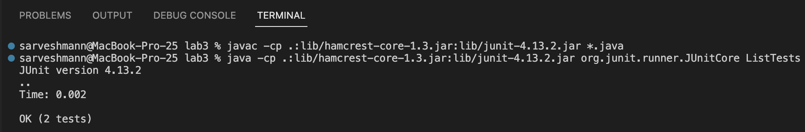

# Lab Report 2

## **Objectives:**

1. Write a web server.

2. Analyze a bug from Lab 3.

3. Reflect on what I learned.

## **1: Write a web server**

> ### Step 1 -  Code for the StringServer:

> ### Step 2 - Implementing the "**add-message**" query:
      
> ### Step 3 - Testing the "**add-message**" query:
      
## **2: Analyze a bug from Lab 3**

> ### Step 1 -  Choose a bug from Lab 3:

I am choosing an **'infinite loop' bug** I found in the "merge" method of the file named "ListExamples.java", the original code for which is as follows:
 

<pre> // Takes two sorted list of strings (so "a" appears before "b" and so on),
 // and return a new list that has all the strings in both list in sorted order.
  static List<String> merge(List<String> list1, List<String> list2) {
  &nbsp;&nbsp;&nbsp;&nbsp;List<String> result = new ArrayList<>();
  &nbsp;&nbsp;&nbsp;&nbsp;int index1 = 0, index2 = 0; 
  &nbsp;&nbsp;&nbsp;&nbsp;while(index1 < list1.size() && index2 < list2.size()) {
  &nbsp;&nbsp;&nbsp;&nbsp;&nbsp;&nbsp;&nbsp;&nbsp;if(list1.get(index1).compareTo(list2.get(index2)) < 0) {
  &nbsp;&nbsp;&nbsp;&nbsp;&nbsp;&nbsp;&nbsp;&nbsp;&nbsp;&nbsp;&nbsp;&nbsp;result.add(list1.get(index1));
  &nbsp;&nbsp;&nbsp;&nbsp;&nbsp;&nbsp;&nbsp;&nbsp;&nbsp;&nbsp;&nbsp;&nbsp;index1 += 1;
  &nbsp;&nbsp;&nbsp;&nbsp;&nbsp;&nbsp;&nbsp;&nbsp;}
  &nbsp;&nbsp;&nbsp;&nbsp;&nbsp;&nbsp;&nbsp;&nbsp;else {
  &nbsp;&nbsp;&nbsp;&nbsp;&nbsp;&nbsp;&nbsp;&nbsp;&nbsp;&nbsp;&nbsp;&nbsp;result.add(list2.get(index2));
  &nbsp;&nbsp;&nbsp;&nbsp;&nbsp;&nbsp;&nbsp;&nbsp;&nbsp;&nbsp;&nbsp;&nbsp;index2 += 1;
  &nbsp;&nbsp;&nbsp;&nbsp;&nbsp;&nbsp;&nbsp;&nbsp;}
  &nbsp;&nbsp;&nbsp;&nbsp;}
  &nbsp;&nbsp;&nbsp;&nbsp;while(index1 < list1.size()) {
  &nbsp;&nbsp;&nbsp;&nbsp;&nbsp;&nbsp;&nbsp;&nbsp;result.add(list1.get(index1));
  &nbsp;&nbsp;&nbsp;&nbsp;&nbsp;&nbsp;&nbsp;&nbsp;index1 += 1;
  &nbsp;&nbsp;&nbsp;&nbsp;
  &nbsp;&nbsp;&nbsp;&nbsp;while(index2 < list2.size()) {
  &nbsp;&nbsp;&nbsp;&nbsp;&nbsp;&nbsp;&nbsp;&nbsp;result.add(list2.get(index2));
  &nbsp;&nbsp;&nbsp;&nbsp;&nbsp;&nbsp;&nbsp;&nbsp;index1 += 1;
  &nbsp;&nbsp;&nbsp;&nbsp;}
  &nbsp;&nbsp;&nbsp;&nbsp;return result;
  } </pre>
  
  
  
 
> ### Step 2 -  Failure inducing input:

  An example of a **failure inducing input** (as a JUnit test) where we try to merge two sorted ArrayLists is as follows:
   
  
  <pre> @Test
  public void testMerge(){
  &nbsp;&nbsp;&nbsp;&nbsp;// inputs
  &nbsp;&nbsp;&nbsp;&nbsp;List<String> input1 = Arrays.asList("a", "c", "e");
  &nbsp;&nbsp;&nbsp;&nbsp;List<String> input2 = Arrays.asList("b", "d", "f");
  &nbsp;&nbsp;&nbsp;&nbsp;List<String> expected1 = Arrays.asList("a", "b", "c", "d", "e", "f");
  &nbsp;&nbsp;&nbsp;&nbsp;assertEquals(null, expected1, ListExamples.merge(input1, input2));   
  } </pre>
   
  
 
> ### Step 3 -  Passing input:

  An example of an **input that doesn't cause failure** (as a JUnit test) where we try to merge two sorted ArrayLists is as follows:
   
  
  <pre> @Test
  public void testMerge1(){
  &nbsp;&nbsp;&nbsp;&nbsp;// inputs
  &nbsp;&nbsp;&nbsp;&nbsp;List<String> input1 = Arrays.asList("a", "c", "e");
  &nbsp;&nbsp;&nbsp;&nbsp;List<String> input2 = Arrays.asList();
  &nbsp;&nbsp;&nbsp;&nbsp;List<String> expected1 = Arrays.asList("a", "c", "e");
  &nbsp;&nbsp;&nbsp;&nbsp;assertEquals(null, expected1, ListExamples.merge(input1, input2));    
  } </pre>   
  
  
 
> ### Step 4 -  Output of running both tests before fixing the bug:

  When we run the aforementioned tests, we get the following output:
  

> ### Step 5 -  Analyze the bug:
  
  We can find and fix the bug by analyzing the output of the test results above:
  * Two tests were ran but one of them failed.
  * The **passing input** test passed, however, the **failure inducing input** test caused the Java heap space to run out.
  * The line number that caused this symptom can be found at the very end of the test result, which is line number 33.
  * Line number 33 in my code is the last line of the **failure inducing input** test, however this does not inform us much about the bug.
  * If we look at the second to last line of the test result, we can see that the **line number 42** of the **merge method** caused the heap space to run out.
  * Line number 42 is inside the last **while loop** of the **merge** method, which is as follows:
  
  <pre> while(index2 < list2.size()) {
      result.add(list2.get(index2)); //line 42
      index1 += 1;
 } </pre>

  * Looking at the code above, we can quickly find the **bug** that since we are updating **index1** instead of **index2**, the while loop never ends.
  * Therefore, **changing the index1 to index2 in line number 43 should fix the bug**.
  
> ### Step 5 -  Fix the bug:

  * **Code Before:**

<pre> // Takes two sorted list of strings (so "a" appears before "b" and so on),
 // and return a new list that has all the strings in both list in sorted order.
  static List<String> merge(List<String> list1, List<String> list2) {
  &nbsp;&nbsp;&nbsp;&nbsp;List<String> result = new ArrayList<>();
  &nbsp;&nbsp;&nbsp;&nbsp;int index1 = 0, index2 = 0; 
  &nbsp;&nbsp;&nbsp;&nbsp;while(index1 < list1.size() && index2 < list2.size()) {
  &nbsp;&nbsp;&nbsp;&nbsp;&nbsp;&nbsp;&nbsp;&nbsp;if(list1.get(index1).compareTo(list2.get(index2)) < 0) {
  &nbsp;&nbsp;&nbsp;&nbsp;&nbsp;&nbsp;&nbsp;&nbsp;&nbsp;&nbsp;&nbsp;&nbsp;result.add(list1.get(index1));
  &nbsp;&nbsp;&nbsp;&nbsp;&nbsp;&nbsp;&nbsp;&nbsp;&nbsp;&nbsp;&nbsp;&nbsp;index1 += 1;
  &nbsp;&nbsp;&nbsp;&nbsp;&nbsp;&nbsp;&nbsp;&nbsp;}
  &nbsp;&nbsp;&nbsp;&nbsp;&nbsp;&nbsp;&nbsp;&nbsp;else {
  &nbsp;&nbsp;&nbsp;&nbsp;&nbsp;&nbsp;&nbsp;&nbsp;&nbsp;&nbsp;&nbsp;&nbsp;result.add(list2.get(index2));
  &nbsp;&nbsp;&nbsp;&nbsp;&nbsp;&nbsp;&nbsp;&nbsp;&nbsp;&nbsp;&nbsp;&nbsp;index2 += 1;
  &nbsp;&nbsp;&nbsp;&nbsp;&nbsp;&nbsp;&nbsp;&nbsp;}
  &nbsp;&nbsp;&nbsp;&nbsp;}
  &nbsp;&nbsp;&nbsp;&nbsp;while(index1 < list1.size()) {
  &nbsp;&nbsp;&nbsp;&nbsp;&nbsp;&nbsp;&nbsp;&nbsp;result.add(list1.get(index1));
  &nbsp;&nbsp;&nbsp;&nbsp;&nbsp;&nbsp;&nbsp;&nbsp;index1 += 1;
  &nbsp;&nbsp;&nbsp;&nbsp;
  &nbsp;&nbsp;&nbsp;&nbsp;while(index2 < list2.size()) {
  &nbsp;&nbsp;&nbsp;&nbsp;&nbsp;&nbsp;&nbsp;&nbsp;result.add(list2.get(index2));
  &nbsp;&nbsp;&nbsp;&nbsp;&nbsp;&nbsp;&nbsp;&nbsp;index1 += 1; // line 43
  &nbsp;&nbsp;&nbsp;&nbsp;}
  &nbsp;&nbsp;&nbsp;&nbsp;return result;
  } </pre>
  
  
 
  * **Code After:**

<pre> // Takes two sorted list of strings (so "a" appears before "b" and so on),
 // and return a new list that has all the strings in both list in sorted order.
  static List<String> merge(List<String> list1, List<String> list2) {
  &nbsp;&nbsp;&nbsp;&nbsp;List<String> result = new ArrayList<>();
  &nbsp;&nbsp;&nbsp;&nbsp;int index1 = 0, index2 = 0; 
  &nbsp;&nbsp;&nbsp;&nbsp;while(index1 < list1.size() && index2 < list2.size()) {
  &nbsp;&nbsp;&nbsp;&nbsp;&nbsp;&nbsp;&nbsp;&nbsp;if(list1.get(index1).compareTo(list2.get(index2)) < 0) {
  &nbsp;&nbsp;&nbsp;&nbsp;&nbsp;&nbsp;&nbsp;&nbsp;&nbsp;&nbsp;&nbsp;&nbsp;result.add(list1.get(index1));
  &nbsp;&nbsp;&nbsp;&nbsp;&nbsp;&nbsp;&nbsp;&nbsp;&nbsp;&nbsp;&nbsp;&nbsp;index1 += 1;
  &nbsp;&nbsp;&nbsp;&nbsp;&nbsp;&nbsp;&nbsp;&nbsp;}
  &nbsp;&nbsp;&nbsp;&nbsp;&nbsp;&nbsp;&nbsp;&nbsp;else {
  &nbsp;&nbsp;&nbsp;&nbsp;&nbsp;&nbsp;&nbsp;&nbsp;&nbsp;&nbsp;&nbsp;&nbsp;result.add(list2.get(index2));
  &nbsp;&nbsp;&nbsp;&nbsp;&nbsp;&nbsp;&nbsp;&nbsp;&nbsp;&nbsp;&nbsp;&nbsp;index2 += 1;
  &nbsp;&nbsp;&nbsp;&nbsp;&nbsp;&nbsp;&nbsp;&nbsp;}
  &nbsp;&nbsp;&nbsp;&nbsp;}
  &nbsp;&nbsp;&nbsp;&nbsp;while(index1 < list1.size()) {
  &nbsp;&nbsp;&nbsp;&nbsp;&nbsp;&nbsp;&nbsp;&nbsp;result.add(list1.get(index1));
  &nbsp;&nbsp;&nbsp;&nbsp;&nbsp;&nbsp;&nbsp;&nbsp;index1 += 1;
  &nbsp;&nbsp;&nbsp;&nbsp;
  &nbsp;&nbsp;&nbsp;&nbsp;while(index2 < list2.size()) {
  &nbsp;&nbsp;&nbsp;&nbsp;&nbsp;&nbsp;&nbsp;&nbsp;result.add(list2.get(index2)); 
  &nbsp;&nbsp;&nbsp;&nbsp;&nbsp;&nbsp;&nbsp;&nbsp;index2 += 1; // line 43
  &nbsp;&nbsp;&nbsp;&nbsp;}
  &nbsp;&nbsp;&nbsp;&nbsp;return result;
  } </pre>
  
  
  
> ### Step 6 -  Output of both tests after fixing the bug:

 

  
## **3: Reflect on what I learned**

  * To see your current working directory, type the command: `pwd`
  
       
  
  * To list the contents in this directory, type the command: `ls`

       

  * To print out the contents of a text file, type the command: `cat helloworld.txt` (Note: file name might be different for you)
 
       

 
> ## Congratulations! you have successfully completed all of the objectives.
