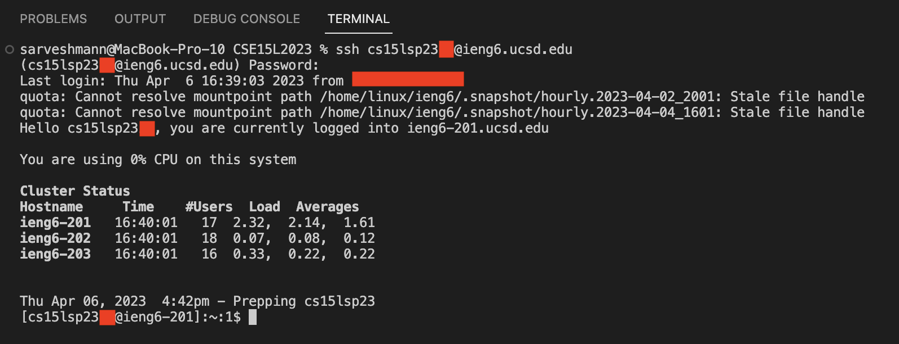

# Lab Report 2

## **Objectives:**

1. Write a web server.

2. Analyze a bug from Lab 3.

3. Reflect on what I learned.

## **1: Write a web server**

> ### Step 1 -  Installing VScode:

  * Go to [VScode](https://code.visualstudio.com).
  * Select your operating system from the dropdown list.
  
      
  
  * Follow the instructions to download and install VScode.
   
*(If you are not using Windows operating system, skip to Step 2.)*
  * Download and install [Git for Windows](https://gitforwindows.org).
  * Follow the steps on this [link](https://stackoverflow.com/questions/42606837/how-do-i-use-bash-on-windows-from-the-visual-studio-code-integrated-terminal/50527994#50527994) to learn how to use Bash on VScode.

> ### Step 2 - Remotely Connecting

  * Open the Terminal window on VScode, using ctrl or command + ` or by clicking on Terminal -> New Terminal menu option.
  
      
      
  * Copy and paste (or type) the following command on your Terminal window: `ssh cs15lsp23zz@ieng6.ucsd.edu`
 
      
      
  * Replace "zz" in the command with the letters in your course-specific account and press Enter.
  * You will be prompted to enter your account password, type in your password and press Enter.
  
      
      
  * Congratulations! Now, you're remotely connected to your account.
     
      
      
> ### Step 3 - Trying some commands

*(Note: Prior to performing the following steps, if your terminal is open, kill the Terminal to avoid the 'Permission Denied' error.)*
      
## **2: Analyze a bug from Lab 3**

> ### Step 1 -  Choose a bug from Lab 3:

I am choosing an **'infinite loop' bug** I found in the "merge" method of the file named "ListExamples.java", the original code for which is as follows:
 

<code>// Takes two sorted list of strings (so "a" appears before "b" and so on),  
 // and return a new list that has all the strings in both list in sorted order.  
  static List<String> merge(List<String> list1, List<String> list2) {  
  &nbsp;&nbsp;&nbsp;&nbsp;List<String> result = new ArrayList<>();  
  &nbsp;&nbsp;&nbsp;&nbsp;int index1 = 0, index2 = 0;  
  &nbsp;&nbsp;&nbsp;&nbsp;while(index1 < list1.size() && index2 < list2.size()) {  
  &nbsp;&nbsp;&nbsp;&nbsp;&nbsp;&nbsp;&nbsp;&nbsp;if(list1.get(index1).compareTo(list2.get(index2)) < 0) {  
  &nbsp;&nbsp;&nbsp;&nbsp;&nbsp;&nbsp;&nbsp;&nbsp;&nbsp;&nbsp;&nbsp;&nbsp;result.add(list1.get(index1));  
  &nbsp;&nbsp;&nbsp;&nbsp;&nbsp;&nbsp;&nbsp;&nbsp;&nbsp;&nbsp;&nbsp;&nbsp;index1 += 1;  
  &nbsp;&nbsp;&nbsp;&nbsp;&nbsp;&nbsp;&nbsp;&nbsp;}  
  &nbsp;&nbsp;&nbsp;&nbsp;&nbsp;&nbsp;&nbsp;&nbsp;else {  
  &nbsp;&nbsp;&nbsp;&nbsp;&nbsp;&nbsp;&nbsp;&nbsp;&nbsp;&nbsp;&nbsp;&nbsp;result.add(list2.get(index2));  
  &nbsp;&nbsp;&nbsp;&nbsp;&nbsp;&nbsp;&nbsp;&nbsp;&nbsp;&nbsp;&nbsp;&nbsp;index2 += 1;  
  &nbsp;&nbsp;&nbsp;&nbsp;&nbsp;&nbsp;&nbsp;&nbsp;}  
  &nbsp;&nbsp;&nbsp;&nbsp;}  
  &nbsp;&nbsp;&nbsp;&nbsp;while(index1 < list1.size()) {  
  &nbsp;&nbsp;&nbsp;&nbsp;&nbsp;&nbsp;&nbsp;&nbsp;result.add(list1.get(index1));  
  &nbsp;&nbsp;&nbsp;&nbsp;&nbsp;&nbsp;&nbsp;&nbsp;index1 += 1;  
  &nbsp;&nbsp;&nbsp;&nbsp;}  
  &nbsp;&nbsp;&nbsp;&nbsp;while(index2 < list2.size()) {  
  &nbsp;&nbsp;&nbsp;&nbsp;&nbsp;&nbsp;&nbsp;&nbsp;result.add(list2.get(index2));  
  &nbsp;&nbsp;&nbsp;&nbsp;&nbsp;&nbsp;&nbsp;&nbsp;index1 += 1;  
  &nbsp;&nbsp;&nbsp;&nbsp;}  
  &nbsp;&nbsp;&nbsp;&nbsp;return result;  
  }</code>
  
  
> ### Step 2 -  Failure inducing input:
  An example of a **failure inducing input** (as a JUnit test) where we try to merge two sorted ArrayLists is as follows:
   
  
  <code>@Test 
  public void testMerge(){ 
  &nbsp;&nbsp;&nbsp;&nbsp;// inputs 
  &nbsp;&nbsp;&nbsp;&nbsp;List<String> input1 = Arrays.asList("a", "c", "e"); 
  &nbsp;&nbsp;&nbsp;&nbsp;List<String> input2 = Arrays.asList("b", "d", "f"); 
  &nbsp;&nbsp;&nbsp;&nbsp;List<String> expected1 = Arrays.asList("a", "b", "c", "d", "e", "f"); 
  &nbsp;&nbsp;&nbsp;&nbsp;assertEquals(null, expected1, ListExamples.merge(input1, input2));     
  }</code>
   
  
> ### Step 3 -  Passing input:
  An example of an **input that doesn't cause failure** (as a JUnit test) where we try to merge two sorted ArrayLists is as follows:
   
  
  <code>@Test 
  public void testMerge1(){ 
  &nbsp;&nbsp;&nbsp;&nbsp;// inputs 
  &nbsp;&nbsp;&nbsp;&nbsp;List<String> input1 = Arrays.asList("a", "c", "e"); 
  &nbsp;&nbsp;&nbsp;&nbsp;List<String> input2 = Arrays.asList(); 
  &nbsp;&nbsp;&nbsp;&nbsp;List<String> expected1 = Arrays.asList("a", "c", "e"); 
  &nbsp;&nbsp;&nbsp;&nbsp;assertEquals(null, expected1, ListExamples.merge(input1, input2));      
  }</code>   
  
  
> ### Step 4 -  Output of running both tests:
  When we run the aforementioned tests, we get the following output:
 
      
  

## **3: Reflect on what I learned**

  * To see your current working directory, type the command: `pwd`
  
       
  
  * To list the contents in this directory, type the command: `ls`

       

  * To print out the contents of a text file, type the command: `cat helloworld.txt` (Note: file name might be different for you)
 
       

 
> ## Congratulations! you have successfully completed all of the objectives.
