# Lab Report 4

## **Objectives:**

1. Remotely access the repository.

2. Edit files in the repository.

3. Commit the changes and push to the repository.

## **Instructions:**

> ### Step 1 -  Remotely access the repository:

  * Log into ieng6.
  
      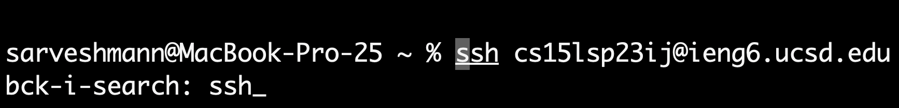
      
       
      
      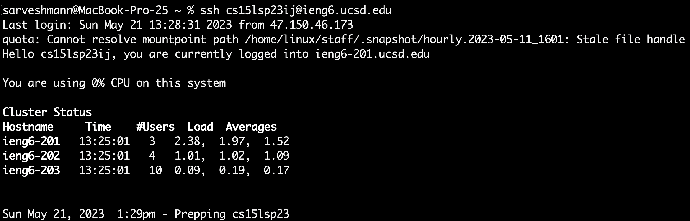
      
      *Keys pressed: `<ctrl+r><ssh><enter>`*
       
      *I used the `ctrl+r` command to enter the "reverse search history" mode. Then, typed `ssh` and pressed `enter` to access `ssh cs15lsp23ij@ieng6.ucsd.edu` in my history.*
      
  * Cloning the repository to the remote account.
 
      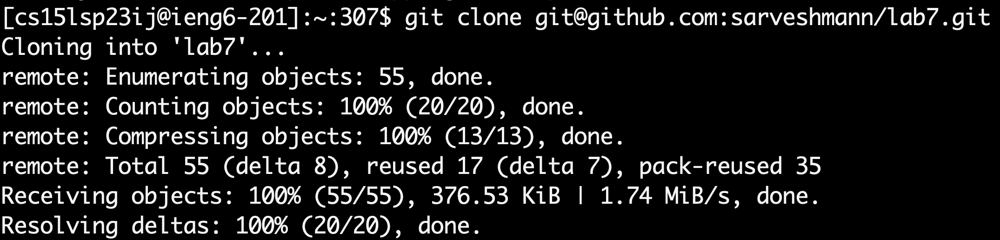
      
      *Keys pressed: `<git clone git@github.com:sarveshmann/lab7.git><enter>`*
       
      *I used the `git clone` command and pressed `enter` to clone the Lab 7 repository on my github account to the remote account.*
      
  * Looking at the contents of cloned files.
 
      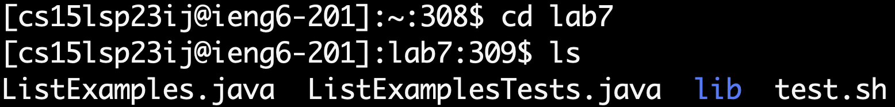
      
      *Keys pressed: `<cd lab7><enter><ls><enter>`*
       
      *I used the `cd` command to change current directory to Lab 7 and the `ls` command to list the contents of Lab 7 directory.*
      
  * Compile and Run the tests java file.
 
      
      
       
      
      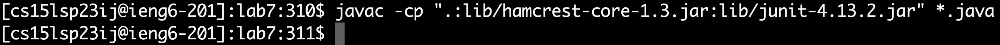
      
      *Keys pressed: `<ctrl+r><javac><enter>`*
       
      *I used the `ctrl+r` command to enter the "reverse search history" mode. Then, typed `javac` and pressed `enter` to access `javac -cp ".:lib/hamcrest-core-1.3.jar:lib/junit-4.13.2.jar" *.java` in my history.*
      
      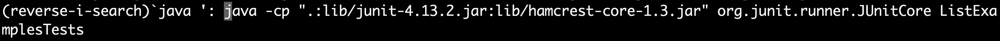
      
      *Keys pressed: `<ctrl+r><java ><enter>` (Note: I have space after "java")* 
       
      *I used the `ctrl+r` command to enter the "reverse search history" mode. Then, typed `java ` and pressed `enter` to access `java -cp ".:lib/junit-4.13.2.jar:lib/hamcrest-core-1.3.jar" org.junit.runner.JUnitCore ListExamplesTests` in my history.*
      
      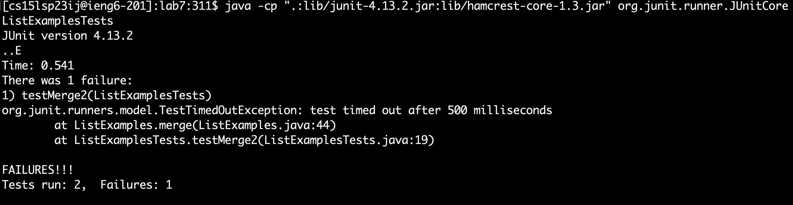
     
      *Here, we can see two Junit tests were ran and one of them failed. Now, in the next step, we will edit the ListExamples.java file to fix the error in the "merge" method using just the command-line*

> ### Step 2 - Edit files in the repository:

  * Enter the editor mode to edit the ListExamples.java file.
  
      
      
      *Keys pressed: `<vim ><ListExamples.java><enter>` (Note: I have space after "vim")*
       
      *I used the `vim` command to edit the "ListExamples.java" file.*
      
      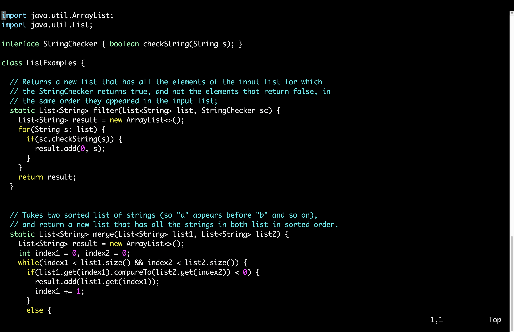
      
      *Here, we can see the vim-editor view of the file.*
      
  * Go to the bug and fix it.
  
      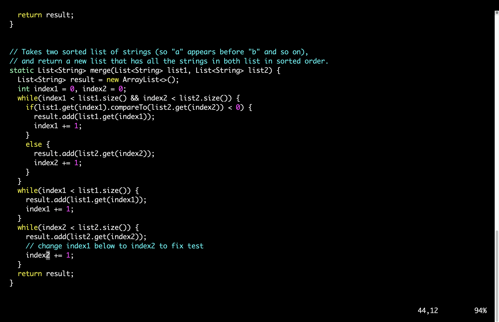
      
      *Keys pressed: `<G><6k><enter><e><r2>` (Note: It's a upper-case 'G')*
       
      *I used the `G` command to go to the end of the file. Then, I used `k` command to go up six times by putting 6 in front of it. After that, I pressed `e` command to go to last character, which is '1', of the first word, which is 'index1' and used the `r` command with 2 after it to replace '1' with '2'.*
      
  * Saving the edited file.
 
      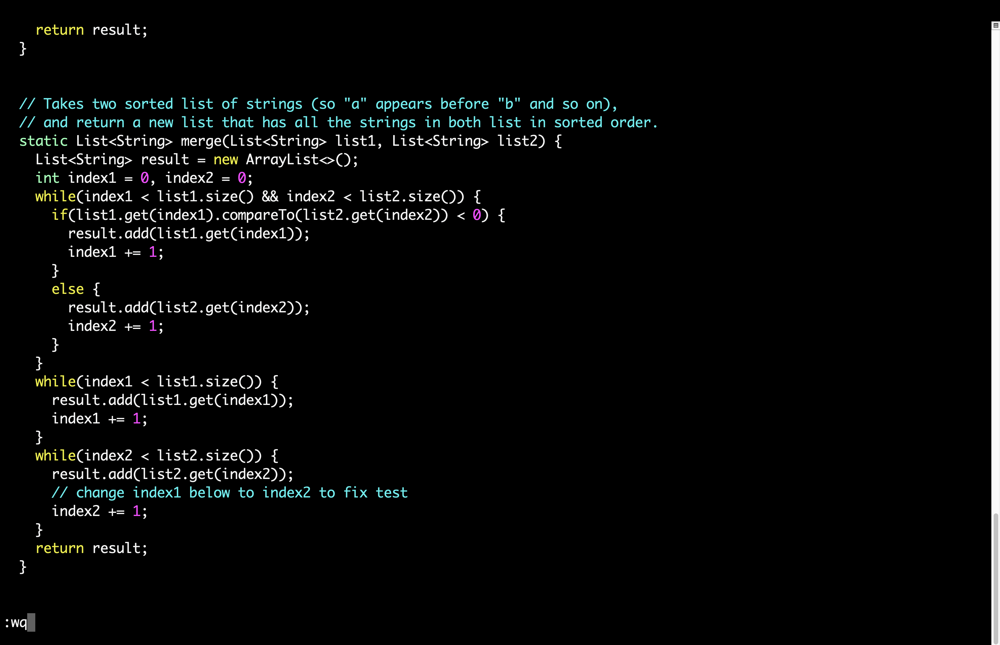
      
      *Keys pressed: `<:wq><enter>`*
       
      *I used the `w` command to save the changes along with `q` command to quit the editor mode.*
 
   * Compile and Run the tests java file.
 
      
            
       
      
      
      
      *Keys pressed: `<ctrl+r><javac><enter>`*
       
      *I used the `ctrl+r` command to enter the "reverse search history" mode. Then, typed `javac` and pressed `enter` to access `javac -cp ".:lib/hamcrest-core-1.3.jar:lib/junit-4.13.2.jar" *.java` in my history.*
      
      
      
      *Keys pressed: `<ctrl+r><java ><enter>` (Note: I have space after "java")*
       
      *I used the `ctrl+r` command to enter the "reverse search history" mode. Then, typed `java ` and pressed `enter` to access `java -cp ".:lib/junit-4.13.2.jar:lib/hamcrest-core-1.3.jar" org.junit.runner.JUnitCore ListExamplesTests` in my history.*
      
      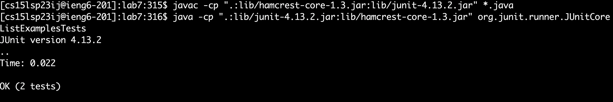
      
      *Here, we can see two Junit tests were ran and both of them passed. So, we fixed the bug. Now, in the next step, we will commit the changes and push to the repository using the command-line only.*
      
> ### Step 3 - Commit the changes and push to the repository:

  * Using `git add` to track the files.
  
      
      
      *Keys pressed: `<git add *><enter>`*
      
       
      *I used the `git add` command with a `*` next to it to track all the files in Lab 7.*
      
  * Commit the changes.
  
      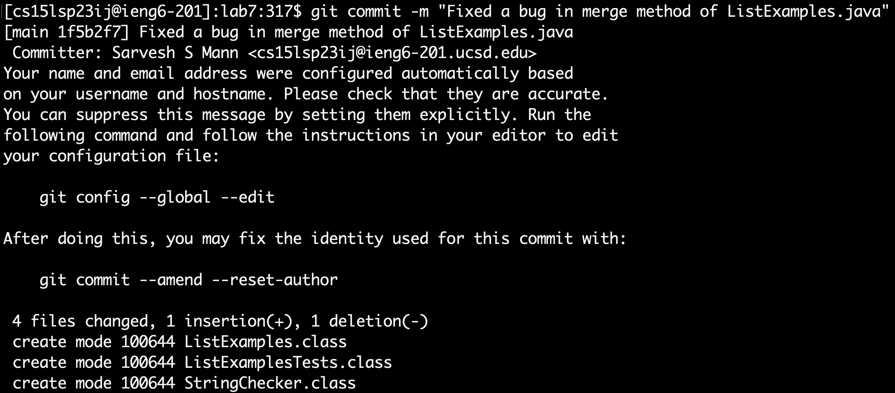
      
      *Keys pressed: `<git commit -m "Fixed a bug in merge method of ListExamples.java"><enter>` (Note: Inside the quotes, the message can be anything)*
       
      *I used the `git commit` command and its option `-m` to commit all the changes, along with a commit message.*
      
  * Push to the repository.
 
      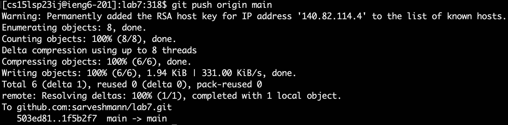
      
      *Keys pressed: `<git push origin main><enter>`*
       
      *I used the `git push` command to push the changes to my Github account. Now, all the changes should be reflected on Github.*

 
> ## Congratulations! you have successfully completed all of the objectives.
