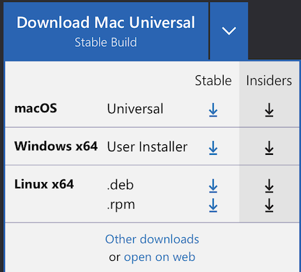
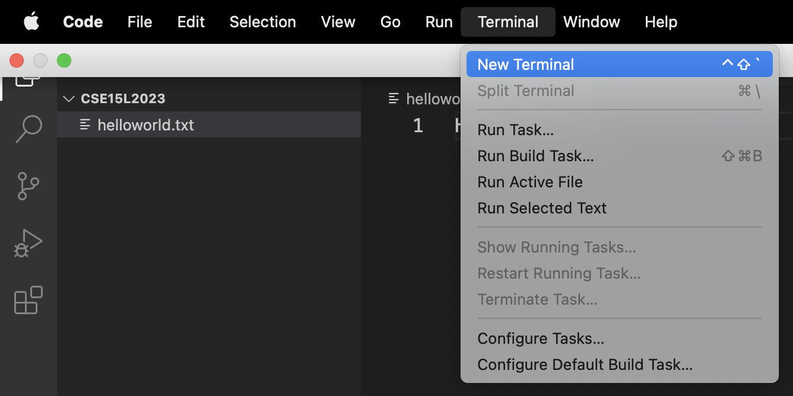
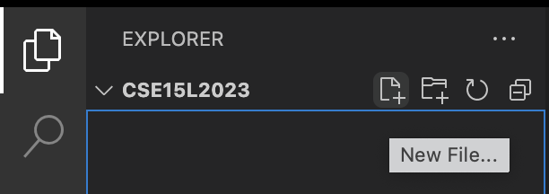

# Lab Report 4

## **Objectives:**

1. Remotely access the repository.

2. Edit files in the repository.

3. Commit the changes and push to the repository.

## **Instructions:**

> ### Step 1 -  Remotely access the repository:

  * Log into ieng6.
  
      
      
      *Keys pressed: `<ctrl+r><ssh><enter>`*
      *I used the `ctrl+r` command to enter the "reverse search history" mode. Then, typed `ssh` and pressed `enter` to access `ssh cs15lsp23ij@ieng6.ucsd.edu` in my history.
      
  * Cloning the repository to the remote account.
 
      
      
      *Keys pressed: `<git clone git@github.com:sarveshmann/lab7.git><enter>`*
      *I used the `git clone` command and pressed `enter` to clone the Lab 7 repository on my github account to the remote account.
      
  * Looking at the contents of cloned files.
 
      
      
      *Keys pressed: `<cd lab7><enter><ls><enter>`*
      *I used the `cd` command to change current directory to Lab 7 and the `ls` command to list the contents of Lab 7 directory.
      
  * Compile and Run the tests java file.
 
      
      
      *Keys pressed: `<ctrl+r><javac><enter>`*
      *I used the `ctrl+r` command to enter the "reverse search history" mode. Then, typed `javac` and pressed `enter` to access `javac -cp ".:lib/hamcrest-core-1.3.jar:lib/junit-4.13.2.jar" *.java` in my history.
      
      
      
      *Keys pressed: `<ctrl+r><java ><enter>` (Note: I have space after "java")*  
      *I used the `ctrl+r` command to enter the "reverse search history" mode. Then, typed `java ` and pressed `enter` to access `java -cp ".:lib/junit-4.13.2.jar:lib/hamcrest-core-1.3.jar" org.junit.runner.JUnitCore ListExamplesTests` in my history.
      
      
      
      *Here, we can see two Junit tests were ran and one of them failed. Now, in the next step, we will edit the ListExamples.java file to fix the error in the "merge" method using just the command-line*

> ### Step 2 - Edit files in the repository:

  * Enter the editor mode to edit the ListExamples.java file.
  
      
      
      *Keys pressed: `<vim ><ListExamples.java><enter>` (Note: I have space after "vim")*
      *I used the `vim` command to edit the "ListExamples.java" file.
      
  * Go to the bug and fix it.
  
      
      
      *Keys pressed: `<G><6k><enter><e><r2>` (Note: It's a upper-case 'G')*
      *I used the `G` command to go to the end of the file. Then, I used `k` command to go up six times by putting 6 in front of it. After that, I pressed `e` command to go to last character, which is '1', of the first word, which is 'index1' and used the `r` command with 2 after it to replace '1' with '2'.
      
  * Saving the edited file.
 
      
      
      *Keys pressed: `<:wq><enter>`*
      *I used the `w` command to save the changes along with `q` command to quit the editor mode.
      
  * Replace "zz" in the command with the letters in your course-specific account and press Enter.
  * You will be prompted to enter your account password, type in your password and press Enter.
  
      
      
  * Congratulations! Now, you're remotely connected to your account.
     
      
      
> ### Step 3 - Commit the changes and push to the repository:

*(Note: Prior to performing the following steps, if your terminal is open, kill the Terminal to avoid the 'Permission Denied' error.)*
      
**Before we try some commands, let's upload a text file to your course-specific account:**

  * Create an empty folder on your computer and name it something like: CSE15L2023
  * Now, open this folder in VScode using ctrl or command + o or by clicking on File -> Open menu option.
  * Inside this folder, create a new text file as shown below.
  
      
      
  * Give a name to it something like: helloworld.txt (make sure to append the name with '.txt' extension)

      
      
  * Type in anything you want in this text file (make sure to hit enter at the end to create a new empty line for readability purposes in the Terminal later).

      
      
  * Save everything by using ctrl or command + s or by clicking on File -> Save menu option.
  * Open the Terminal window.
  * Copy and paste (or type) the following command in your Terminal window: `scp helloworld.txt cs15lsp23zz@ieng6.ucsd.edu:~/`
  * Replace "zz" in the command with the letters in your course-specific account and press Enter.
  * You will be prompted to enter your account password, type in your password and press Enter.
  * Congratulations! Now, you have successfully uploaded a text file to your course-specific account.

       

*(After uploading the file, kill the terminal again and reconnect remotely using the instructions in Step 2.)*

**Let's try some useful commands now:**

  * To see your current working directory, type the command: `pwd`
  
       
  
  * To list the contents in this directory, type the command: `ls`

       

  * To print out the contents of a text file, type the command: `cat helloworld.txt` (Note: file name might be different for you)
 
       

 
> ## Congratulations! you have successfully completed all of the objectives.
