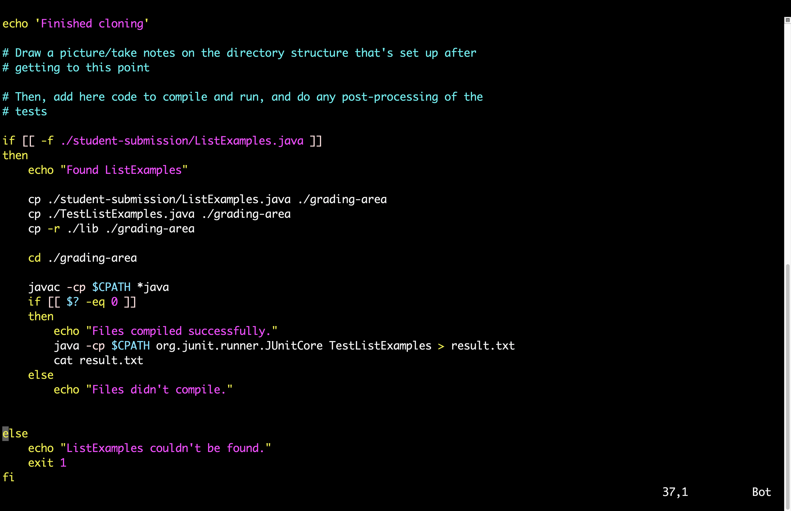
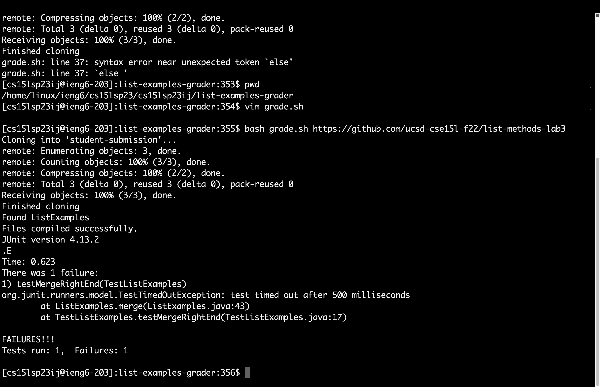

# Lab Report 5

## **Objectives:**

1. Debugging scenario.

2. Reflection.

## **Part 1 - Debugging Scenario:**

> ### Student EdStem post:

  * **Title**: Weird error while running bash script. 
      
  * **What environment are you using (computer, operating system, web browser, terminal/editor, and so on)?**
    <br>I am using the terminal to run the program on a remote account on a MacBook. 

  * **Detail the symptom you're seeing. Be specific; include both what you're seeing and what you expected to see instead. Screenshots are great, copy-pasted         terminal output is also great. Avoid saying “it doesn't work”.**
      <br>It tells me there is an error on line #37 with the `else` statement in my `grade.sh` file. I expected it to run the tests and give me the output. Here is a screenshot:
        


  * **Detail the failure-inducing input and context. That might mean any or all of the command you're running, a test case, command-line arguments, working           directory, even the last few commands you ran. Do your best to provide as much context as you can.**
        <br> I ran this command `bash grade.sh https://github.com/ucsd-cse15l-f22/list-methods-lab3` which runs the grade.sh script using a github repository. My current working directory is `/home/linux/ieng6/cs15lsp23/cs15lsp23ij/list-examples-grader`
 
> ### Responses:

  * **TA**: Hey! You are right, it seems like your `grade.sh` script file is potentially missing a statement. Try the following command to look into your grade.sh file: `vim grade.sh`. Afterwards, go to line #37 using this shortcut: `37G`

  * **Student**: Hey! thanks for your response. I tried the commands you told me and here is a screenshot of what I see:



        
   * **TA**: It looks like you are missing the `fi` statement after your last inner `if/else` conditional. Go up two lines using the shortcut: `2k`. Then, go to the appropriate indentation using `h` to go left, `l` to go right. After going to the appropriate location, use `i` to start editing your file at that location and type `fi`, which ends your inner `if/else` condition. And, lastly, press `esc` to escape editing mode, and use the command `:wq` to save and quit. Now, you should be able to run your bash script. Let me know if it works now!

  * **Student**: Hey! thank you so much! it works now. Here is a screenshot:
  


> ### Setup information:

  * **File and directory structure**: Updated `list-examples-grader` from lab 9. Here's a [link](https://github.com/sarveshmann/list-examples-grader.git)
for it.
  * **Content before the fix**: The only change that I made to cause the error was inside `grade.sh` file. Below is the content of it:

```
CPATH='.:lib/hamcrest-core-1.3.jar:lib/junit-4.13.2.jar'

rm -rf student-submission
rm -rf grading-area

mkdir grading-area

git clone $1 student-submission
echo 'Finished cloning'

# Draw a picture/take notes on the directory structure that's set up after
# getting to this point

# Then, add here code to compile and run, and do any post-processing of the
# tests

if [[ -f ./student-submission/ListExamples.java ]]
then 
    echo "Found ListExamples"

    cp ./student-submission/ListExamples.java ./grading-area
    cp ./TestListExamples.java ./grading-area
    cp -r ./lib ./grading-area 
    
    cd ./grading-area

    javac -cp $CPATH *java
    if [[ $? -eq 0 ]]
    then
        echo "Files compiled successfully."
        java -cp $CPATH org.junit.runner.JUnitCore TestListExamples > result.txt
        cat result.txt
    else
        echo "Files didn't compile."
    
    
else 
    echo "ListExamples couldn't be found."
    exit 1
fi
```

  * **Command ran to cause the error**: `bash grade.sh https://github.com/ucsd-cse15l-f22/list-methods-lab3`
  * **Fix for the bug**: Add `fi` to end the inner `if/else` conditional before line #37.

## **Part 2 - Reflection:**

During the second half of the quarter I learned so many new and useful things that I never even heard of before. The two most useful things that I now use almost in every programming assignment are `vim` and the `debugger`. It is really cool to know that I can pretty much do everything using just my terminal with `vim`. Not to mention, the `debugger` has solved so many of my problems while trying to fix my errors in a programming assignment. For instance, now, I don't have to manually add print statements everytime I am trying to fix a bug. I can just use the `debugger` and just type `print` to inspect any relative data. Finally, I would like to thank Professor Politz and all the staff for teaching me so many cool things.

<br>

> ## *Thank you for your time!*

