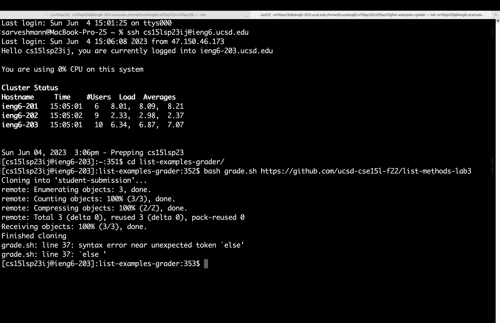

# Lab Report 5

## **Objectives:**

1. Debugging scenario.

2. Reflection.

## **Part 1 - Debugging Scenario:**
> ### Student EdStem post:

  * **Title**: Weird error while running bash script. 
      
  * **What environment are you using (computer, operating system, web browser, terminal/editor, and so on)?**
     I am using the terminal to run the program on a remote account on a MacBook. 

  * **Detail the symptom you're seeing. Be specific; include both what you're seeing and what you expected to see instead. Screenshots are great, copy-pasted         terminal output is also great. Avoid saying “it doesn't work”.**
       It tells me there is an error on line #37 with the `else` statement in my `grade.sh` file. I expected it to run the tests and give me the output. Here is a screenshot:
        

  * **Detail the failure-inducing input and context. That might mean any or all of the command you're running, a test case, command-line arguments, working           directory, even the last few commands you ran. Do your best to provide as much context as you can.**
          I ran this command `bash grade.sh https://github.com/ucsd-cse15l-f22/list-methods-lab3` which runs the grade.sh script using a github repository. My current working directory is `/home/linux/ieng6/cs15lsp23/cs15lsp23ij/list-examples-grader`
 
> ### Responses:

  * **Tutor**: Hey! You are right, it seems like your `grade.sh` script file is potentially missing a statement. Try the following command to look into your grade.sh file: `vim grade.sh`. Afterwards, go to line #37 using this shortcut: `37G`

  * **Student**: Hey! thanks for your response. I tried the commands you told me and here is a screenshot of what I see:

        
   * **Tutor**: It looks like you are missing the `fi` statement after your last inner `if/else` conditional. Go up to lines using the shortcut: `2k`. Then, go to the appropriate indentation using `h` to go left, `l` to go right. After going to the appropriate location, use `i` to start editing your file at that location and type `fi`, which ends your inner `if/else` condition. And, lastly, press `esc` to escape editing mode, and use the command `:wq` to save and quit. Now, you should be able to run your bash script. Let me know if it works now!

  * **Student**: Hey! thank you so much! it works now. Here is a screenshot:
  

> ## *Thank you for your time!*

